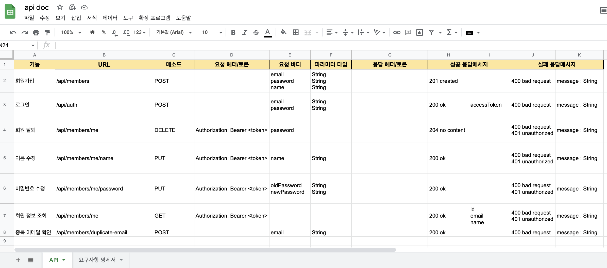
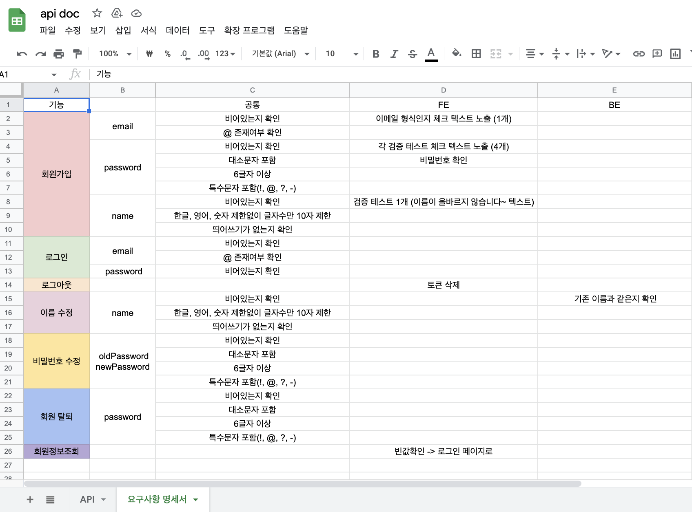
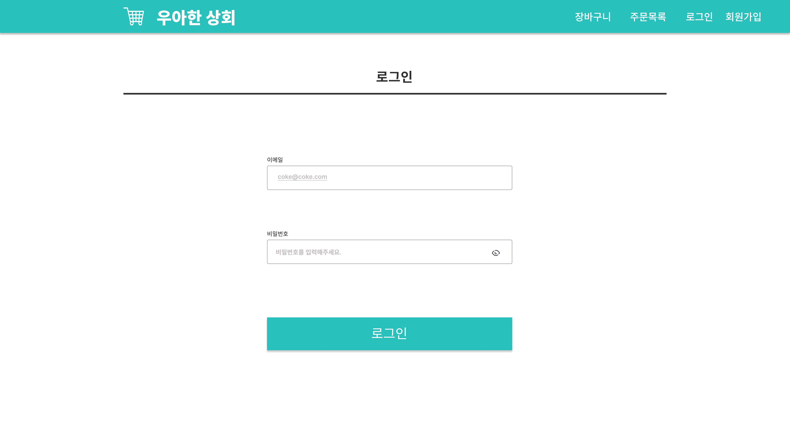
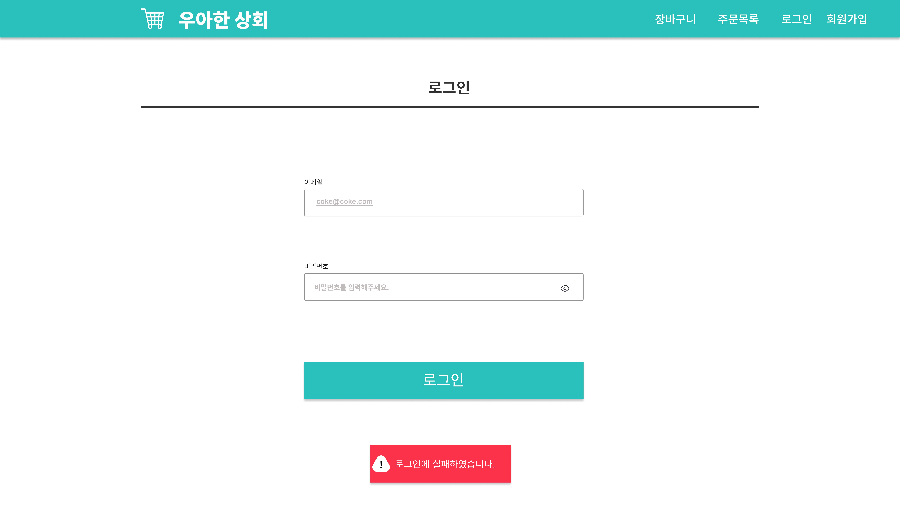
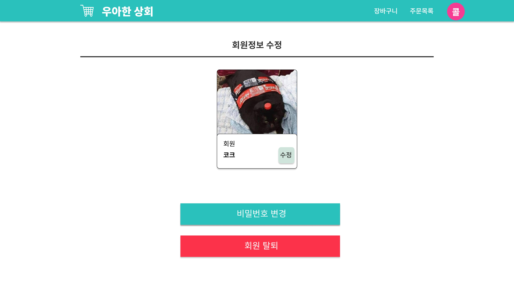
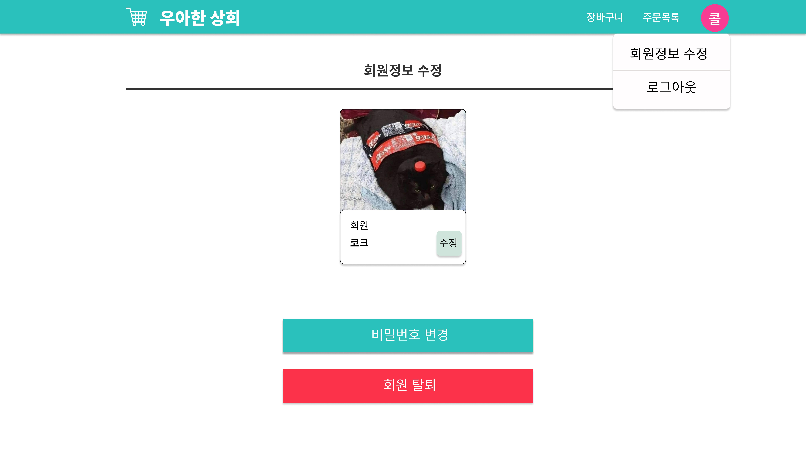
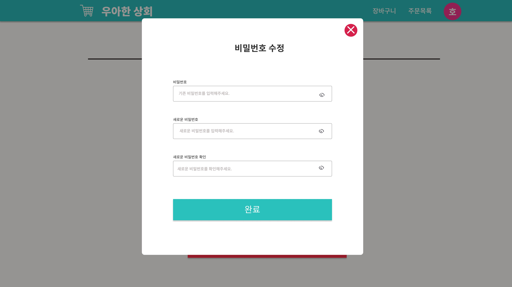
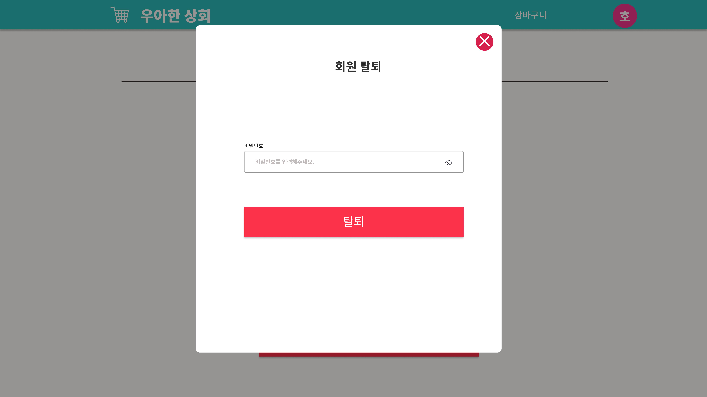

# [장바구니 협업 미션 ](https://github.com/woowacourse/react-shopping-cart-prod)

> 서버 개발자분들과 함께 협업한 내용을 담았습니다.

---

# :ledger: 목차

- 팀원
- 미션 요구사항(FE)
- BE api 명세서
- FE 명세서

---

## :handshake: 팀원

### 서버 개발자

- 후니 [https://github.com/jayjaehunchoi](https://github.com/jayjaehunchoi)
- 마루 [https://github.com/chawani](https://github.com/chawani)
- 아리 [https://github.com/ulimy](https://github.com/ulimy)
- 렉스 [https://github.com/Seongwon97](https://github.com/Seongwon97)

### 프론트 개발자

- 호프 [https://github.com/moonheekim0118](https://github.com/moonheekim0118)
- 코카콜라 [https://github.com/intae92](https://github.com/intae92)

---

## :fire: 미션 요구사항(FE)

> 🚀 Getting Started 레벨 2에서 학습한 컴포넌트 기반 개발, 상태 관리 방법에 대한 내용을 전반적으로 복습하며 적용하는 연습을 합니다

- ✔️ 백엔드 개발자와 협업하기 위한 커뮤니케이션 경험을 쌓습니다.
- ✔️ 기존 미션을 재활용하되 A to Z까지 완성된 모던 웹 애플리케이션을 상상하며 구현한다.
- ✔️ 백엔드 크루들의 API 설계 논의부터 참여하고 협업하여 사용자 인증을 구현한다.
- ✔️ API를 모킹하고 갈아끼울 수 있는 형태로 대비한다.
- ✔️ Persist를 고려해 앱을 설계하고 복잡한 Life Cycle을 관리하여 Production 수준까지 고려한다.
- ✔️ 배민상회 서비스 참고

### 📝 Requirements

#### 필수 요구사항

- MSW를 활용한 API mocking
- Token기반의 로그인
- 회원가입
- 회원 정보 수정
- 회원탈퇴

---

## :sparkles: BE api 명세서

1. API 
2. 요구사항 명세서 

---

## :sparkles: FE 명세서

1. 로그인 
2. 회원가입 
3. 로그인 실패(snackbar 노출) 
4. 회원정보 수정 
5. DropDown Nav 
6. 비밀번호 수정 
7. 회원 탈퇴 
